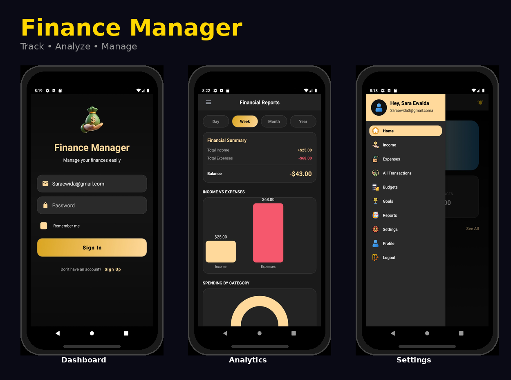
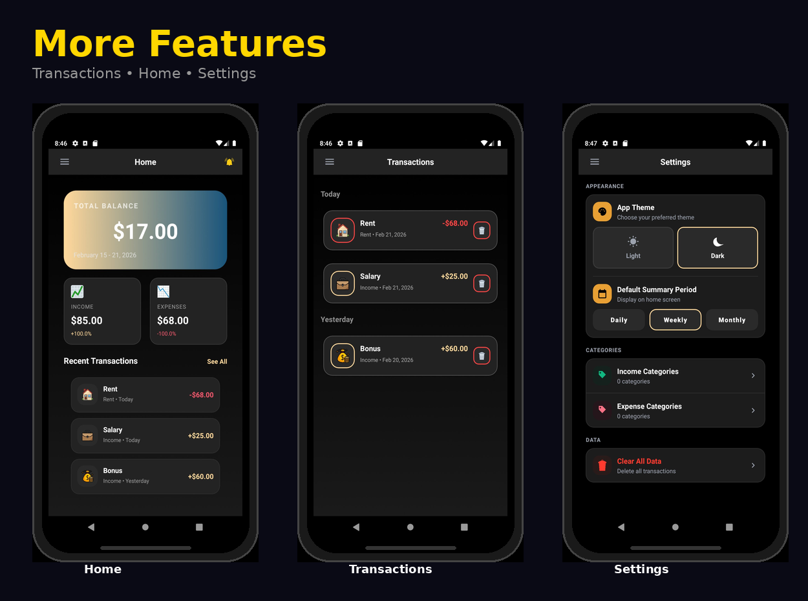

# Personal Finance Android App 

Track income, expenses, budgets, and goals in one place.

## Features
- Multi-user: Sign up / Sign in / Logout
- Remember Me
- Add / Edit / Delete income & expense transactions
- Categories management
- Budgets & alerts
- Summary dashboard + reports

## Tech Stack
- Android (Java)
- SharedPreferences
- RecyclerView + Adapters
- Material Design

## Screenshots

## How to Run
1. Open in Android Studio
2. Sync Gradle
3. Run on an emulator or a real device

## Authors
- Sara Ewaida

